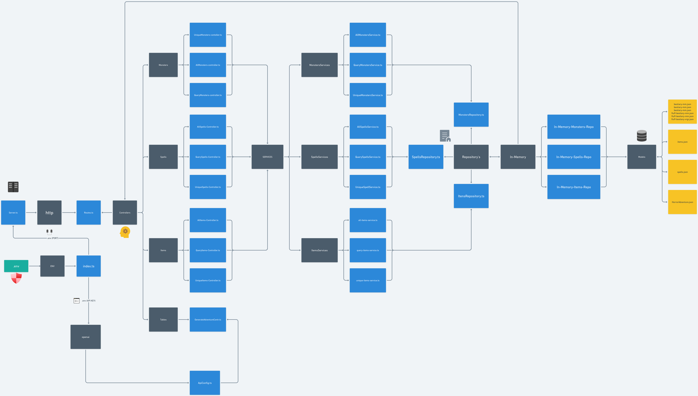

# Monkeys & Dungeons API
## Start Project
Follow the steps:
```bash
git clone https://github.com/Victor-Palha/monkeys-and-dungeons-api.git
cd monkeys-and-dungeons-api
npm install
npm run dev
```
## ENV
*   You need to create a `.env` file in the root of the project
*   You can find more information in the file `.env.example`
## Tests
*   After you config the `.env` file, you can run the tests
    *   To run the tests, you need to run the command `npm run test`
## Build
*  To build the project, you need configure the `tsconfig.json` file
```json
{
  "compilerOptions": {
    "target": "es2020",
    "module": "NodeNext",           
    "moduleResolution": "nodenext",
    "outDir": "build",
    "esModuleInterop": true,     
    "forceConsistentCasingInFileNames": true,            
    "strict": false,
    "skipLibCheck": true
  },
  "include": ["./src/**/*"],
}
```
*   After that, you can run the command `npm run build`
    *   The build will be in the `build` folder
    *   You can run the build with the command `npm run start`
    *   You can see better the build in the `package.json` file
## Endpoints
### Spells
*   Get all Spells: `http://localhost:5000/spells`
*   Query Spells: `http://localhost:5000/spells/query`
    *   **Query Params**
        *   **nome** -> Spell Name
        *   **classe** -> Spell Class
        *   **action** -> Action to conjure the spell (ex: `1 action`, `bonus action`, `reaction`)
        *   **concentration** -> If the spell require Concentration (ex: `true`, `false`)
        *   **ritual** -> If the spell can be cast as ritual (ex: `true`, `false`)
        *   **school** -> Spell School (ex: `Conjuration`, `Evocation`, etc...)
        *   **source** -> Book where spell are (ex: `XGE`, `PHB`, `TCE`, `AAG`, `AI`, `FTD`, `SCC`)
*   Unique Spell: `http://localhost:5000/spells/query/:id`
    *   **Route Params**
        * You need to informe the ID from the Spell!
### Itens
*   Get all Itens: `http://localhost:5000/itens`
*   Query Itens: `http://localhost:5000/itens/query`
    *   **Query Params**
        *   **nome** -> Item Name
        *   **typo** -> Item Type (ex: `Armor`, `Weapon`, `Potion`, etc...)
        *   **rarity** -> Item Rarity (ex: `Common`, `Uncommon`, `Rare`, `Varies` etc...)
        *   **requiresAttunement** -> If the item need to be attuned (ex: `true`, `false`)
*   Unique Item: `http://localhost:5000/itens/query/:id`
    *   **Route Params**
        * You need to informe the ID from the Item!
### Monsters
*   Get all Monsters: `http://localhost:5000/monsters`
*   Query Monsters: `http://localhost:5000/monsters/query`
    *   **Query Params**
        *   **nome** -> Monster Name
        *   **typo** -> Monster Type (ex: `Aberration`, `Beast`, `Celestial`, etc...)
        *   **cr** -> Monster Challenge Rating (ex: `0`, `1/8`, `1/4`, `1/2`, `1`, etc...)
        *   **Image** -> If Monster has Image (ex: `true`, `false`)
        *   **source** -> Book where Monster are (ex: `MM`, `MPMM`, `VRGR`)
*   Unique Monster: `http://localhost:5000/monsters/query/:id`
    *   **Route Params**
        * You need to informe the ID from the Monster!
## How The Ecosystem Works?


### Explanation
As you can see, the ecosystem is divided in 3 parts:
*  **Controller**: The controller is responsible to receive the request and send to the service;
*  **Service**: The service is responsible to receive the request from the controller and send to the repository;
*  **Repository**: The repository is responsible to receive the request from the service and send to the database;
*  **Database**: The database is responsible to receive the request from the repository and send to the service.
### Why?
I follow this pattern because it's more easy to maintain the code, and it's more easy to test the code using unit tests. If i need to change the database from JSON to SQL or NoSQL, i just need to change the repository and all the code is divided in layers, so i don't need to worry about the other parts of the code when i change something.

## What is the purpose of this project?
The purpose of this project is to create a API to help the players of Dungeons & Dragons to find the spells, itens and monsters that they need to play the game. The API will be used in a future project that i will create, a website to help the players to create their characters and manage their campaigns. But most important, this project is to help me to learn more about Design Patterns, Clean Code, SOLID, TDD, DDD, etc...
