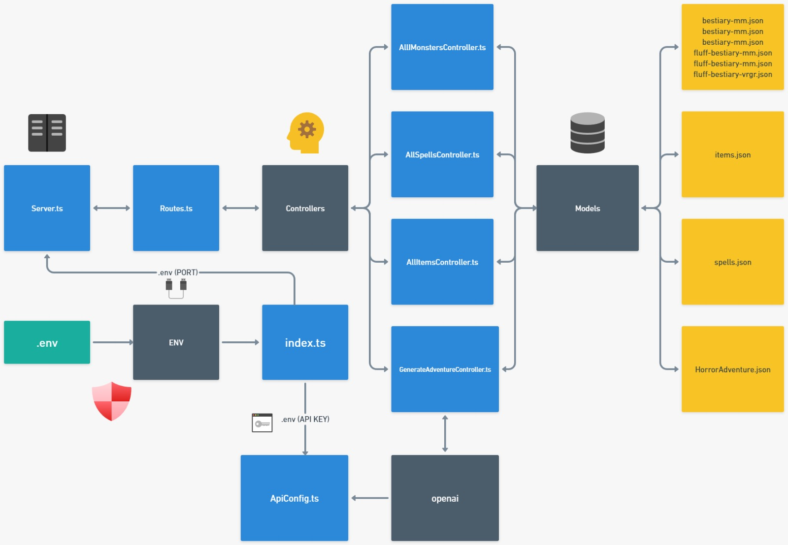

# Monkeys & Dungeons API
## Start Project
Follow the steps:
```bash
git clone https://github.com/Victor-Palha/monkeys-and-dungeons-api.git
cd monkeys-and-dungeons-api
npm install
npm run dev
```
## ENV
*   You need to create a `.env` file in the root of the project
*   You can find more information in the file `.env.example`
## Tests
*   After you config the `.env` file, you can run the tests
    *   To run the tests, you need to run the command `npm run test`
## Routes
### Spells
*   Get all Spells: `http://localhost:5000/spells`
*   Query Spells: `http://localhost:5000/spells/query`
    *   **Query Params**
        *   **nome** -> Spell Name
        *   **classe** -> Spell Class
        *   **action** -> Action to conjure the spell (ex: `1 action`, `bonus action`, `reaction`)
        *   **concentration** -> If the spell require Concentration (ex: `true`, `false`)
        *   **ritual** -> If the spell can be cast as ritual (ex: `true`, `false`)
        *   **school** -> Spell School (ex: `Conjuration`, `Evocation`, etc...)
        *   **source** -> Book where spell are (ex: `XGE`, `PHB`, `TCE`, `AAG`, `AI`, `FTD`, `SCC`)
*   Unique Spell: `http://localhost:5000/spells/query/:id`
    *   **Route Params**
        * You need to informe the ID from the Spell!
### Itens
*   Get all Itens: `http://localhost:5000/itens`
*   Query Itens: `http://localhost:5000/itens/query`
    *   **Query Params**
        *   **nome** -> Item Name
        *   **typo** -> Item Type (ex: `Armor`, `Weapon`, `Potion`, etc...)
        *   **rarity** -> Item Rarity (ex: `Common`, `Uncommon`, `Rare`, `Varies` etc...)
        *   **requiresAttunement** -> If the item need to be attuned (ex: `true`, `false`)
*   Unique Item: `http://localhost:5000/itens/query/:id`
    *   **Route Params**
        * You need to informe the ID from the Item!
### Monsters
*   Get all Monsters: `http://localhost:5000/monsters`
*   Query Monsters: `http://localhost:5000/monsters/query`
    *   **Query Params**
        *   **nome** -> Monster Name
        *   **typo** -> Monster Type (ex: `Aberration`, `Beast`, `Celestial`, etc...)
        *   **cr** -> Monster Challenge Rating (ex: `0`, `1/8`, `1/4`, `1/2`, `1`, etc...)
        *   **Image** -> If Monster has Image (ex: `true`, `false`)
        *   **source** -> Book where Monster are (ex: `MM`, `MPMM`, `VRGR`)
*   Unique Monster: `http://localhost:5000/monsters/query/:id`
    *   **Route Params**
        * You need to informe the ID from the Monster!
## How The Ecosystem Works?

